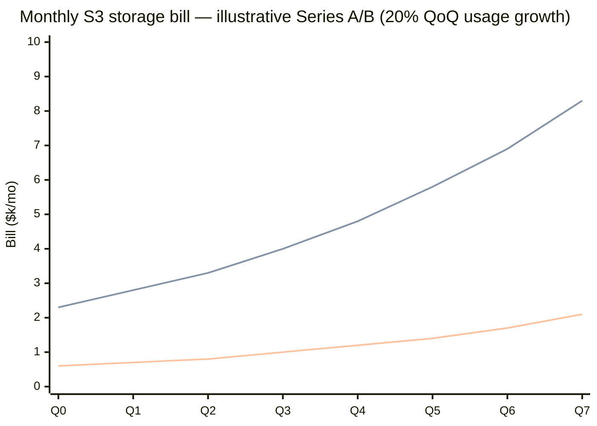
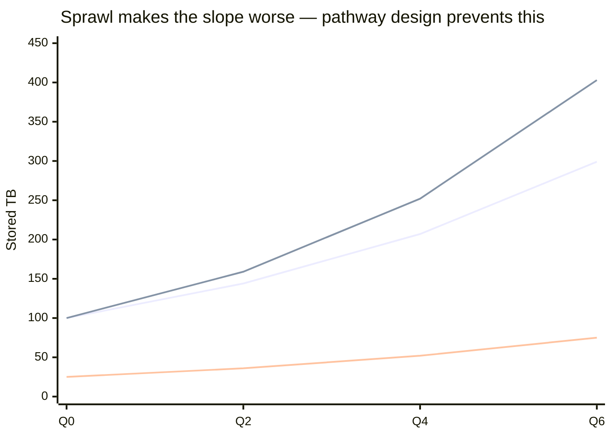

# Storage COGS slope — internal reference (Imogen + Siyang)

> **INTERNAL — founders only (Imogen + Siyang).** Not on the public site or for external sharing.

**Use when:** explaining why a **design session** matters — not just “turn on compression.”  
**Core idea:** AI usage grows fast; without a **storage pathway**, the S3 bill tracks that growth (or worse). With **Fold pathway + GC**, the bill **bends** — same retention, smaller footprint.

---

## One picture

```
  $ bill
  │
  │                                    ╱ Without Fold
  │                               ╱╱╱╱   (tracks usage ~1:1, or worse with sprawl)
  │                          ╱╱╱
  │                     ╱╱╱
  │                ╱╱╱              ╱ AI data generated (usage you need to keep)
  │           ╱╱╱              ╱╱
  │      ╱╱╱               ╱╱
  │ ╱╱╱               ╱╱
  │              ╱╱╱
  │         ╱╱╱  With Fold pathway + GC
  │    ╱╱╱       (bill grows slower than usage — same retention, smaller footprint)
  └──────────────────────────────────────────────► time
        Q0    Q2    Q4    Q6    Q8  (quarters)
```

**Read it left → right:** product succeeds → more inference logs, checkpoints, exports. **Usage line climbs.** Without pathway design, **storage bill climbs with it** — that’s the Series B **narrative problem**. Fold **separates** the bill from raw usage growth.

---

## Mermaid chart (illustrative numbers)

Assumptions: **100 TB** retained today · **$23/TB/mo** · usage grows **20% QoQ** · Fold **~4×** effective on stored bytes after pathway + GC (conservative mid-range).



> **Note:** “AI data retained (no Fold)” and “Without pathway” overlap when bill = raw TB × $23. The gap between the top line and the Fold line is **the story** — not today’s dollar, but **the slope**.

---

## Worked table — 20% QoQ usage growth

Starting point: **100 TB** on S3 today → **~$2,300/mo** (storage only, us-east-1 Standard ~$23/TB).

| Quarter | AI data to retain (TB) | Bill without Fold | Bill with Fold (~4×) | Monthly $ saved | Cumulative $ saved vs no-Fold path |
|---------|------------------------|-------------------|----------------------|-----------------|-------------------------------------|
| Q0 | 100 | $2,300 | $575 | $1,725 | — |
| Q1 | 120 | $2,760 | $690 | $2,070 | $1,725 |
| Q2 | 144 | $3,312 | $828 | $2,484 | $3,795 |
| Q3 | 173 | $3,974 | $994 | $2,980 | $6,279 |
| Q4 | 207 | $4,769 | $1,192 | $3,577 | $9,259 |
| Q5 | 249 | $5,723 | $1,431 | $4,292 | $12,836 |
| Q6 | 299 | $6,868 | $1,717 | $5,151 | $17,128 |
| Q7 | 358 | $8,241 | $2,060 | $6,181 | $22,309 |

**After 2 years (8 quarters):**

| | Without Fold | With Fold (~4×) |
|---|--------------|-----------------|
| Data retained | **358 TB** | **358 TB** (same — lossless) |
| Monthly bill | **~$8.2k/mo** | **~$2.1k/mo** |
| Narrative | “Storage **3.6×** what it was at Series A” | “We kept full retention; **pathway + GC** held COGS down” |

*Ratios vary by workload; design session finds real number (often **3×–5×**, strong cases **~9×**).*

---

## Worse case: sprawl on top of growth (why pathway design matters)

Without a **designed ingest path**, stored bytes can grow **faster than product usage** — duplicate checkpoints, re-embedded corpora, overlapping logs.

Illustrative: same **20% QoQ** real retention need, plus **~5% QoQ structural waste** (duplication sprawl).

| Quarter | TB if pathway clean | TB actually stored (sprawl) | Extra waste vs clean |
|---------|---------------------|----------------------------|----------------------|
| Q0 | 100 | 100 | — |
| Q2 | 144 | ~159 | +10% |
| Q4 | 207 | ~252 | +22% |
| Q6 | 299 | ~403 | +35% |



**Siyang’s design session finds:** where sprawl lives (shared blocks across files, duplicate prefixes, checkpoint copies) → **tune ingest** so new data doesn’t add another messy pile → **GC** on what’s already there.

---

## Two mechanisms, one bent curve

| Phase | Storage-unit analogy | Product | Effect on slope |
|-------|----------------------|---------|-----------------|
| **1. Pathway design** | Arrange boxes **before** they enter the unit | Design session → tuned **ingest** (POST) | New AI data lands **deduped**; sprawl doesn’t compound |
| **2. Tidy existing** | Clean piles **already in** the unit | **`run_garbage_collection`** on bucket | Legacy waste removed; ratio improves on historical TB |

```
  Usage growth ─────────────────────────────►  (you can't / won't stop this)

  Without Fold:
    stored bytes ≈ usage  ─────────────────►  bill ∥ usage  (narrative risk)

  With Fold:
    stored bytes ≈ usage ÷ ratio(pathway)  ──►  bill grows slower than usage
```

---

## What the design session delivers (deck-ready)

| # | Deliverable | Founder sees | Investor sees |
|---|-------------|--------------|---------------|
| 1 | **Data map** | “Here’s what’s actually in our bucket” | Operational maturity |
| 2 | **Pathway design** | “New logs/checkpoints land efficiently” | COGS **trajectory** improves |
| 3 | **Before/after + projection** | Real **×** on *their* data + 12–18 mo bill at growth rate | Unit economics / GM story |

**CEO line:**

> “We don’t sell a black box compressor. We **profile your AI data**, design how it should land on S3, clean what’s piled up — so storage **doesn’t scale one-for-one** with every agent run and training job.”

**CTO line (Siyang):**

> “Generic gzip doesn’t see **cross-file duplication**. We analyze object shapes and shared blocks, tune ingest for your mix, then GC legacy — that’s how you get a ratio that **holds** as volume grows.”

---

## Calculator ↔ slope (how the four cards connect)

| Calculator card | Slope framing |
|-----------------|---------------|
| **You save** | Gap between top two lines **this month** — grows wider every quarter |
| **Store more** | Same **358 TB retained** at Q7 — without paying for 358 TB of billed objects |
| **Put it back in the team** | Dollars that **would have tracked the red line** → eng, inference, GTM, R&D |
| **Better margins** | COGS line in the model **flattens** vs revenue — diligence win |

---

## Assumptions & honesty (say out loud)

- **20% QoQ** is illustrative — ask design partners for their actual growth; use their number in the chart.
- **~4×** is mid-range; design session finds real ratio (**3×** conservative, **5×** typical, **9×** strong on repetitive AI logs/datasets).
- Chart is **storage $ only** — excludes egress, requests, Fold fee.
- Fold does **not** slow product usage — it reduces **what S3 bills** for the same retained data.
- Sprawl scenario is **directional** — design session quantifies *their* sprawl, not a generic 5%.

---

## Quick verbal (30s)

> “Your AI product generates more data every quarter — that’s success. Without a storage pathway, your S3 bill **tracks that growth** and investors ask why COGS keeps rising. We spend ~two days on your bucket: map the data, design ingest so new stuff lands deduped, GC what’s already messy. Same retention, same S3 — but the **bill curve bends**. That’s what goes in your Series B deck.”

---

## Related docs

- **`internal/BUSINESS_CASE.md`** — ICP, investor framing, pilot offer  
- **`internal/SIYANG_SYNC_SHEET.md`** — product analogy, design session timing, sheet proof  
- **`docs/VALUE_TRANSLATION.md`** — savings → runway, GM, reinvestment math (call cheat sheet)  
- **Live calculator:** [fold-sooty.vercel.app/#calculator](https://fold-sooty.vercel.app/#calculator)
